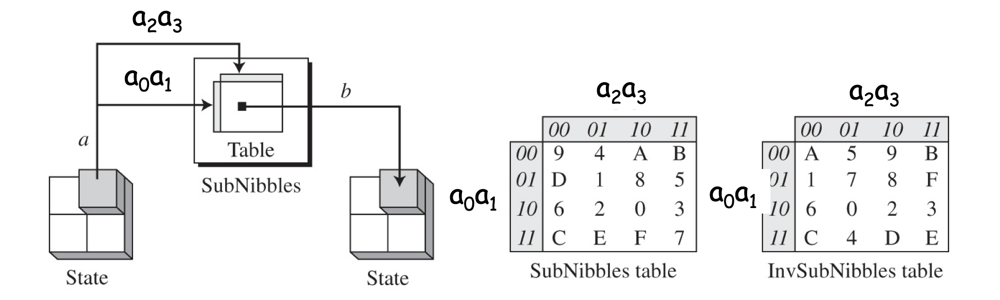
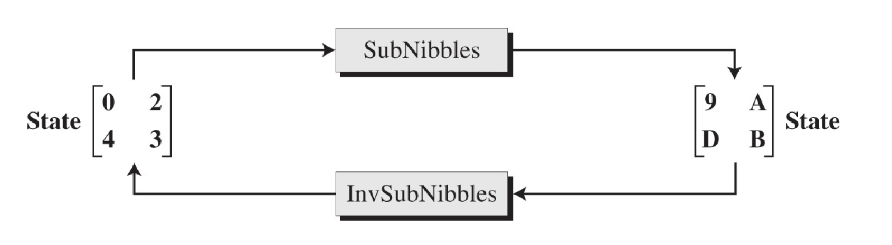
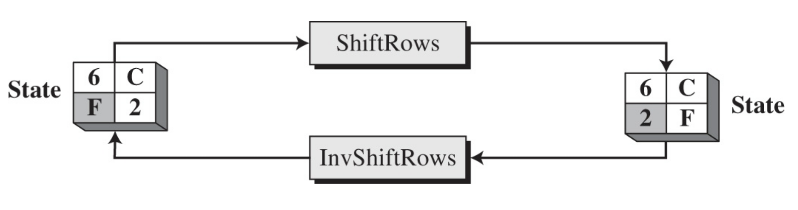
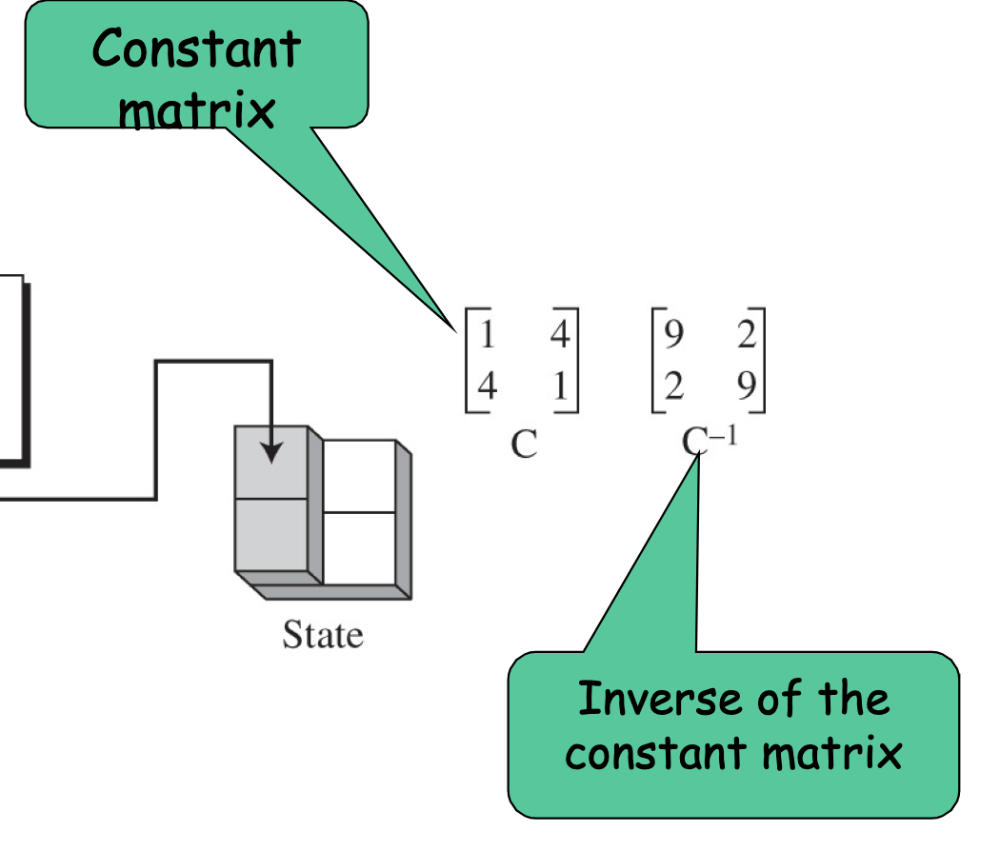
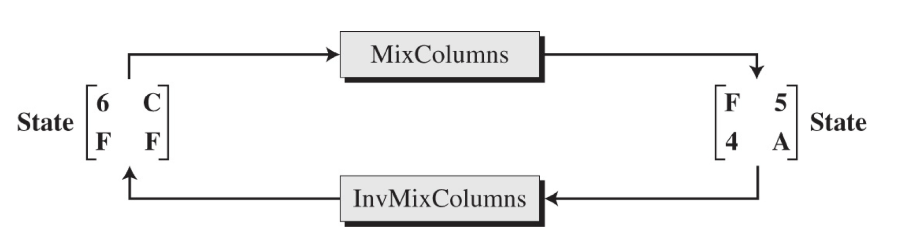
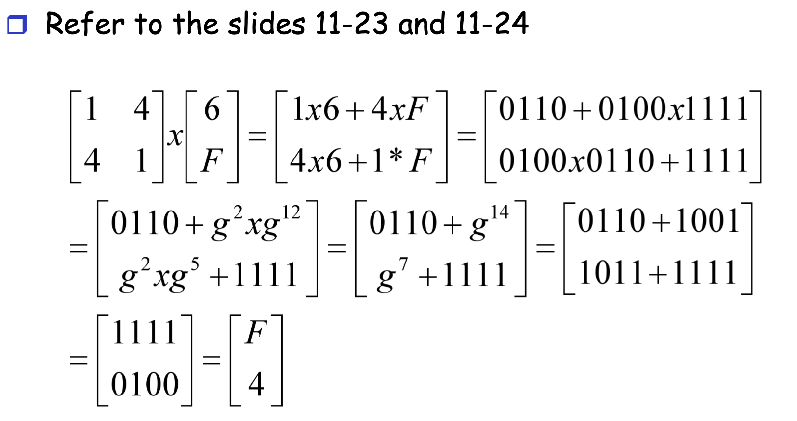
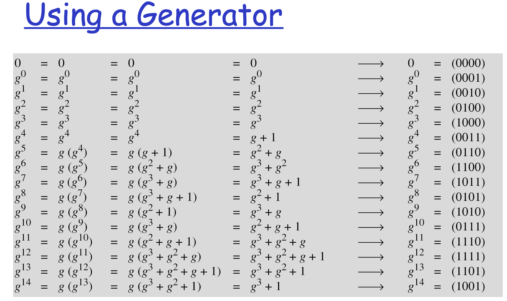
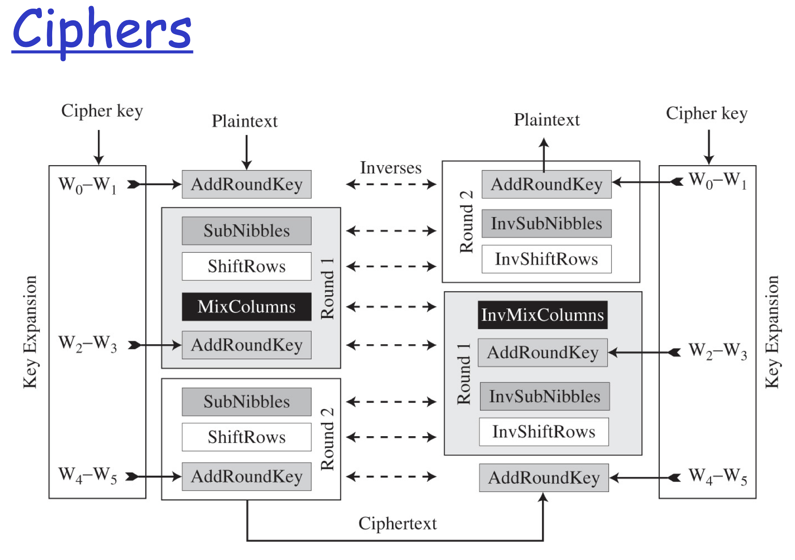
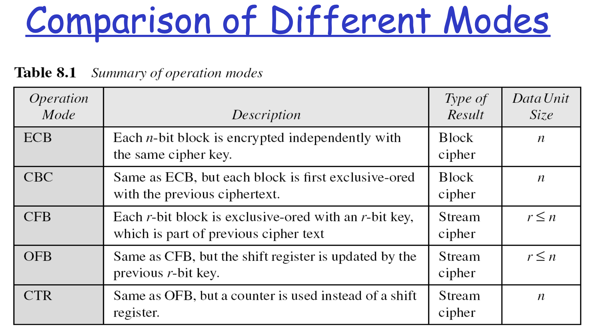
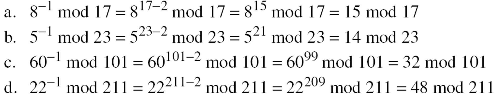

# Final Topics

-  [x] S-AES
-  [x] Modes of operations
-  [x] Mathematics of Cryptography
-  [x] Asymmetric Key Cryptography
-  [ ] Message integrity and authentication
-  [ ] Digital signature
---

## S-AES - Lec12_saes.ppt

-  Basic structure of S-AES
- [x] Data units
- The transformations used by S-AES
- [x] SubNibbles
- [x] ShiftRows
- [x] MixColumns
- [ ] AddRoundKey
- [ ] The key expansion process
- [x] Ciphers

### Data Unit

  | Data Unit | Description |
  | ----------- | ----------- |
  | Bits | <ul><li> A bit is a binary digit with a value of 0 or 1.</li> <li> Use a lowercase letter b to refer to a bit </li></ul>
  | Nibble | <ul><li>A nibble is a group of 4 bits (a hexadecimal digit)</li><li>a row matrix of 4 bits</li><li>• The bits are inserted into the matrix from left to right</li><li>a column matrix of 4 bits</li><li>• The bits are inserted into the matrix from top to bottom</li><li>Use a lowercase bold letter n to refer to a nibble</li></ul> |
  | Word | <ul><li>A word is a groups of 8 bits</li><li>A row matrix of two nibbles</li><li>• The nibbles are inserted into the matrix from left to right</li><li>A column matrix of 2 nibbles</li><li>• The nibbles are inserted into the matrix from top to bottom</li><li>User a lowercase bold letter w to refer to a word</li></ul> |
  | Block | <ul><li>S-AES encrypts and decrypts data blocks.</li><li>A block in S-AES is a group of 16 bits, or a row matrix of 4 nibbles</li></ul> |
  | State | <ul><li>Also refers to a data block</li> <li>Treated as matrices of 4 nibbles</li> <li>Represented by an uppercase bold letter S</li> <li>Each element of a state is referred to as sr,c</li> <li>• r(0,1) defines  the row and c(0,1) defines the column</li> <li>At the beginning of the cipher, nibbles in a data block are inserted into a state column by column, and in each column, from top to bottom</li> <li>At the end of the cipher, nibbles in the state are extracted in the same way</li> </ul> |

### SubNibbles

SubNibbles transformation:  for encryption 
InvSubNibbles transformation: for decryption

**SubNibbles Transformation:**
- To substitute a nibble, we interpret the nibbles as 4bits 
- The left 2 bits define the row, and the right 2 bits define the column of the substitution table
- The hexadecimal digit at the junction of the row and the column is the new nibble
  

- SubNibble --> turn binary to 4 digit hex (0 = 0000, 2 = 0010), use table to get hex
- InvSubNibble --> turn digit into 4 digit hex (9 = 1001, A = 1010), use table to get original Nibbles

### **ShiftRows** *Permutation*

- Done on the encryption side
- **Shifting is to the left**
- - The number of shifts depends on the row number (0,1)
- - - Row 0: not shifted 
- - - Row 1: shiftted 1 nibble
- InvShiftRows
- - Done on the decryption side
- - Inverse of ShiftRows
- - Shifting is to the right
    

### MixColumns

- The transformation is actually the matrix multiplication of a state column by a constant square matrix
- The nibbles in the state column and constant matrix are interpreted as 4-bit words (or polynomials) with coefficients in GF(2)
- Multiplication of bytes is done in GF(24) with modulus (x4 + x + 1) or (10011)
- Addition is the same as XORing of 4-bit words

### AddRoundKey

- 

### The key expansion process

- 

### Cipher

---

## Modes of operations - Lec13_encipherment.ppt
- [x] Electronic Codebook (ECB) Mode
- [x] Cipher Block Chaining (CBC) Mode
- [x] Cipher Feedback (CFB) Mode
- [x] Output Feedback (OFB) Mode
- [x] Counter (CTR) Mode

### Use of  modern standard ciphers( DES/AES)

- DES encrypts and decrypts a block of 64 bits
- AES encrypts and decrypts a block of 128 bits

### Electronic Codebook (ECB) Mode

- The simplest mode of operation is called the electronic codebook (ECB) mode
- The plaintext is divided into N blocks
- The block size is n bits
- If the plaintext size is not a multiple of the block size, the text is padded to make the last block the same size as the other blocks
- The same key is used to encrypt and decrypt each block

**Security issues & Error propagation**
-  Patterns at the block level are preserved
- Equal blocks in the plaintext become equal blocks in the ciphertext
- The block independency creates opportunities for Eve to exchange some ciphertext block without knowing the key
- A single bit error in transmission can create errors in many bits in the corresponding block
- However, the error does not have any effect on the other blocks

### Cipher Block Chaining (CBC) Mode
- In CBC mode, each plaintext block is exclusive-ored with the previous ciphertext block before being encrypted
- When a block is enciphered, the block is sent, but a copy of it is kept in memory to be used in the encryption of the next block
- To encipher the first block, a phony block called initialization vector (IV) us used
- The sender and the receiver agreed on IV

**Security issues & Error propagation**
- In CBC mode, equal plaintext blocks belong to the same message are enciphered into different ciphertext blocks
- - The patterns at the block levels are not preserved
- However, if the two messages are equal, their encipherment is the same if they use the same IV
- - It’s recommended to use a timestamp as an IV
- In CBC mode, a single bit error in ciphertext block Cj during transmission may create error in most bits in plaintext block Pj during decryption
- However, this single error toggles only one bit in plaintext block Pj+1  
- - the bit in the same location
- Plaintext Pj+2 to PN are not affected by this single bit error

### Cipher Feedback (CFB) Mode
- ECB and CBC modes encrypt and decrypt blocks of the message
- The block size is predetermined by the underlying cipher
- In some situations, we need to use DES or AES as secure ciphers, but the plaintext or ciphertext block sizes are to be smaller
- The solution: use DES or AES in cipher feedback mode (CFB)

**Security issues & Error propagation**
- Just like CBC, the patterns at the block level are not preserved
- More than one message can be encrypted with the same key, but the value of the IV should be changed for each message
- Eve can add some ciphertext block to the end of the ciphertext stream
- In CFB, a single bit error in ciphertext block Cj during transmission creates a single bit error (at the same position) in plaintext block Pj
- However, most of the bits in the following plaintext blocks are in error as long as some bits of Cj are still in the shift register

### Output Feedback (OFB) Mode
- OFB is very similar to CFB
- There is only one difference: each bit in the ciphertext is independent of the previous bits
- - This avoids error propagation
- - If an error occurs in transmission, it does not affect the bits that follow
- Like CFB, both the sender and the receiver use the encryption algorithm

**Security issues & Error propagation**
- Security issues
- - Just like CFB, patterns at the block level are not preserved
- Error propagation
- - A single error in the ciphertext affects only the corresponding bit in the plaintext

### Counter (CTR) Mode
- In CTR mode, there is no feedback
- The pseudorandomness in the key stream is achieved using a counter
- An n-bit counter is initialized to a pre-determined value (IV) and incremented based on a predefined rule (mod 2n)
- To provide a better randomness, the increment value can depend on the block number to be incremented

### Comparison of Different Modes

---

## Mathematics of Cryptography - Lec14_math7.ppt
- [x] Relative prime
- [x] Euler’s Phi-Function
- [x] How to calculate φ(n)
- [x] What you can do with φ(n)
- - [x] Order of a group
- - [x] RSA
- - [x] Multiplicative inverse
- Two theorems
- [x] Fermat’s Little Theorem
- [x] Euler’s Theorem
- [ ] Application of the two theorems
- - [ ] Exponentiation
- - [ ] Multiplicative inverse

### Relatively prime (coprime)
- Two positive integers a and b are relatively prime, or coprime, if gcd(a,b) = 1
- 1 is relatively prime  with any integer
- If p is prime, all integers between 1 and p-1 are relatively prime to p

### Euler’s Phi-Function
- The number of integers that are both smaller than n and relatively prime to n

**Some rules**
1. φ(1) = 0
2. φ(p) = p-1 if p is a prime
3. φ(m × n) = φ(m) × φ(n)  if m and n are relatively primes
4. φ(pe) = pe-pe-1  if p is a prime

### Euler's Theorem
- First version: a φ(n) ≡ 1 (mod n)
- - Condition:  gcd(a, n) = 1
- Second version: a k × φ(n) + 1 ≡  a (mod n)
- - k is an integer
- - The condition gcd(a,n) = 1 is removed!
  
- Example 9.15
- - Find the result of 624 mod 35
- - φ(35)  = φ(5)  x φ(7) = 4 x 6 = 24
- - 624 mod 35 ≡ 6φ(35) mod 35 ≡ 1 mod 35

### Fermat’s Little Theorem
- First version
- - If p is a prime and a is an integer
- - And Gcd(a, p) = 1
- - then ap-1 ≡ 1 mod p
- Second version
- - If p is a prime and a is an integer
- - ap ≡ a mod p
- - the 2nd condition on is removed!
  

### Multiplicative inverse
- Fermat’s theorem can be used to find some multiplicative inverses quickly if the modulus is a prime 
- - a x a-1 ≡ 1 mod p 
- - = ap-1 mod p  (by Fermat’s theorem)
- - = a x ap-2 mod p 
- - a-1 ≡ ap-2 mod p
- The conditions on a and p
- p is prime
- Gcd(a,p) = 1

---

## Asymmetric Key Cryptography - Lec16_asymmetric.ppt & Lec17_asymmetric 2.ppt
- [x] The advantages and disadvantages of the two kinds of cryptography
- Three algorithms
-  - [x] RSA  algorithm
-  - [x] Rabin cryptosystem
-  - [x] ElGamal cryptosystem
- RSA cryptosystem
- You need to know
- - [x] Key generation
- - [x] Encryption
- - [x] Decryption
- - [x] Who’s which key is used for encryption

### RSA algorithm
| Key Generation | Encryption | Decryption |
  | ----------- | ----------- | ----------- |
|<ul><li>Bob picks two large primes  p and  q </li> <li>Calculate  n =  p x q</li> <li>Calculate ø(n)</li> <li>ø(n) = ( p-1)x(q-1)   discard p and q</li> <li>Select an integer e</li> <li>gcd(ø(n),e)=1;     1<e<ø(n)</li> <li>Calculate  d=e-1 mod ø(n)</li> <li>Public key  KU={e,n}</li>  <li>Private key    KR={d,n}</li> </ul> | <ul><li>Alice gets Bob’s public key PU={e,n}</li><li>Alice wants to send P to Bob,   P < n</li><li>P is encrypted to C</li><li>C=Pe mod n</li></ul>  | <ul><li>Bob has his private key PR={d,e}</li><li>After Bob gets C, he decrypts C</li><li>Cd mod n = P</li></ul>  | 

### Rabin cryptosystem
| Key Generation | Encryption | Decryption |
  | ----------- | ----------- | ----------- |
|<ul><li>Chose two large primes p and q</li><li>Form: 4k + 3 and p does not equal q</li><li>n = p x q</li><li>Public key: n</li><li>Private key: (q, n) </li></ul> | <ul><li>Where n is the public key and P is the plaintext</li><li>C = P2 mod n</li></ul> | <ul><li>a1 = +(C(p+1)/4) mod p</li><li>a2 = -(C(p+1)/4) mod p</li><li>b1 = +(C(p+1)/4) mod q</li><li>b2 = +(C(p+1)/4) mod q</li><li><b>Use Chinese remainder algorithm</b></li><li>p1 = Chinese_Remainder(a1, b1, p q)</li><li>p2 = Chinese_Remainder(a1, b2, p q)</li><li>p3 = Chinese_Remainder(a2, b1, p q)</li><li>p4 = Chinese_Remainder(a2, b2, p q)</li><li>Return P1 through P4 </li></ul> |

### ElGamal cryptosystem
| Key Generation | Encryption | Decryption |
  | ----------- | ----------- | ----------- |
| <ul><li>Select a large prime p</li><li>Select d to be a member of G = [Zp*, x] and 1 <= d <= p-2</li><li>Select e1 to be a primitive root of G = [Zp*, x]  </li><li>e2 = e1d mod p </li><li>Public key: (e1, e2, p)</li><li>Private key: d</li></ul> | <ul><li>P is plaintext and p is a large prime</li><li>Select a random integer r in the group G = [Zp*, x]</li><li>C1 = e1r mod p</li><li>C2 = (P x e2r ) mod p</li><li>return C1  C2 </li><li>example (5, 6) </li></ul> | <ul><li>Decryption(d, p, C1, C2 )</li><li>C1 and C2 are cipher text </li><li>P = [C2 × C1(p−1−d)] mod p</li></ul>|

**Instead of using P = [C2 × (C1d)−1] mod p for decryption,
we can avoid the calculation of multiplicative inverse and
use  P = [C2 × C1(p−1−d)] mod p**

---

## Message integrity and authentication
- [x] Message integrity and authentication
- [x] Cryptographic hash function criteria
- [ ] Message Authentication Code
- - [ ] How it works
- - [ ] What MAC can do

### Checking Integrity
- Run the cryptographic hash function again
- Compare the new message digest with the previous one
- - If the they match, the original message is not modified

### Cryptographic Hash Function Criteria
- A cryptographic hash function must satisfy three criteria:
- - preimage resistance
- - second preimage resistance
- - collision resistance

--- 

## Digital signature
- Introduction to a digital signature
- - [ ] What is digital signature
- - [ ] What digital signature can do
- - [ ] The differences between MAC and digital signature
- Some digital signature schemes
- - [ ] RSA
- - [ ] ElGamal
- - [ ] DSS
- - You need to know
- - - [ ]  How to sign
- - - [ ] How to verify
- - - [ ] Why it works

--- 

### The differences between MAC and digital signature
- They are based on different kinds of key schemes
- -  MAC is symmetric key based
- - Digital signature is asymmetric key based
- MAC can provide authentication and integrity
- Digital signature can provide authentication, integrity and nonrepudiation

--- 

